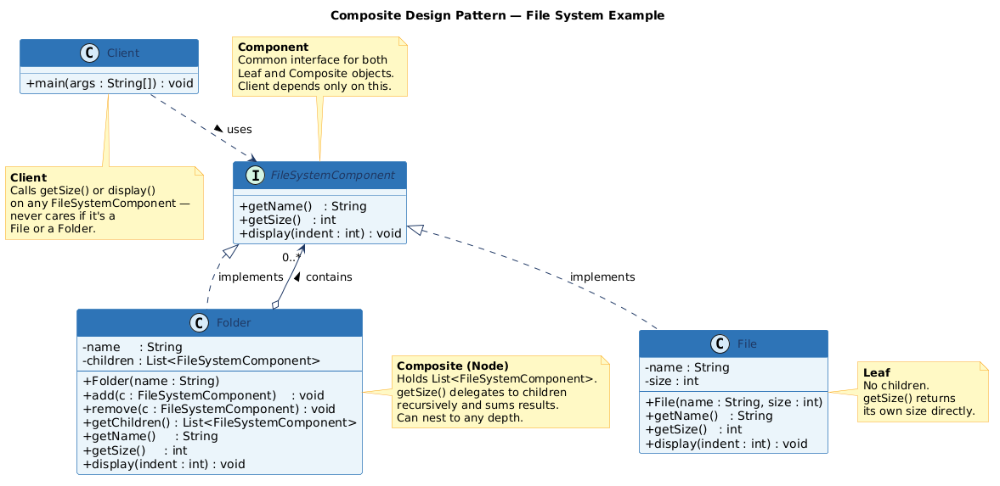

The Composite Design Pattern is a structural design pattern that lets you compose objects into tree-like hierarchies to represent part-whole relationships. It allows clients to treat individual objects (called Leaves) and compositions of objects (called Nodes or Composites) uniformly through a single shared interface.

In simple terms: whether you’re operating on a single file or an entire folder containing thousands of nested files, you call the same method — and the pattern handles the rest recursively.

The Composite pattern is one of the original 23 Gang of Four (GoF) design patterns introduced in Design Patterns: Elements of Reusable Object-Oriented Software (1994), and it remains one of the most practically useful structural patterns in modern software engineering.

[Read Complete Article on Medium](https://medium.com/javarevisited/the-composite-design-pattern-a-complete-guide-with-file-system-example-a2ff3c7ddcdd)

