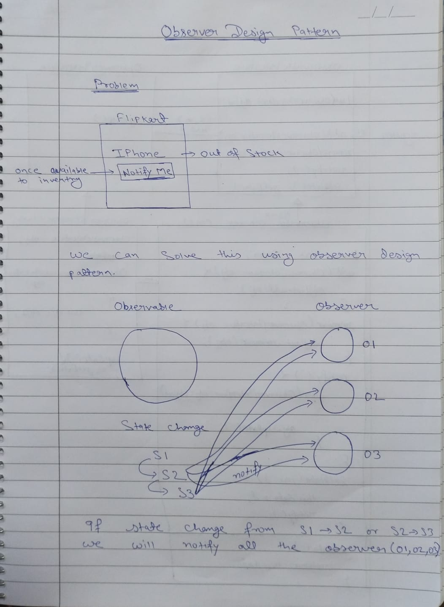
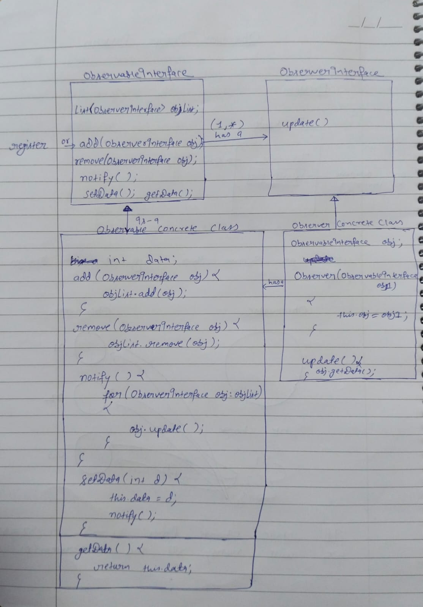

**What is Observer Pattern?**

The observer design pattern is a software design pattern in which an object called the subject, maintains a list of its dependents, called observers, and notifies them automatically of any state changes, usually by calling one of their methods.

**When Do We Use the Observer Pattern?**

The Observer pattern is used when you need many other objects to receive an update when another object changes. For this, the objects (which we call the ‘observers’) have to be tightly coupled in order to reflect the change of a state in one object in another object (which we call the ‘subject/observable’).

## Check the image for more details

## Create class diagram :- https://mermaid.js.org/syntax/classDiagram.html

